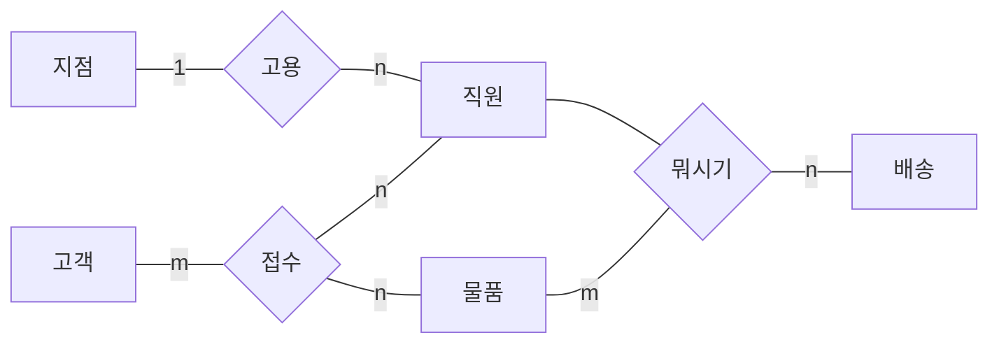
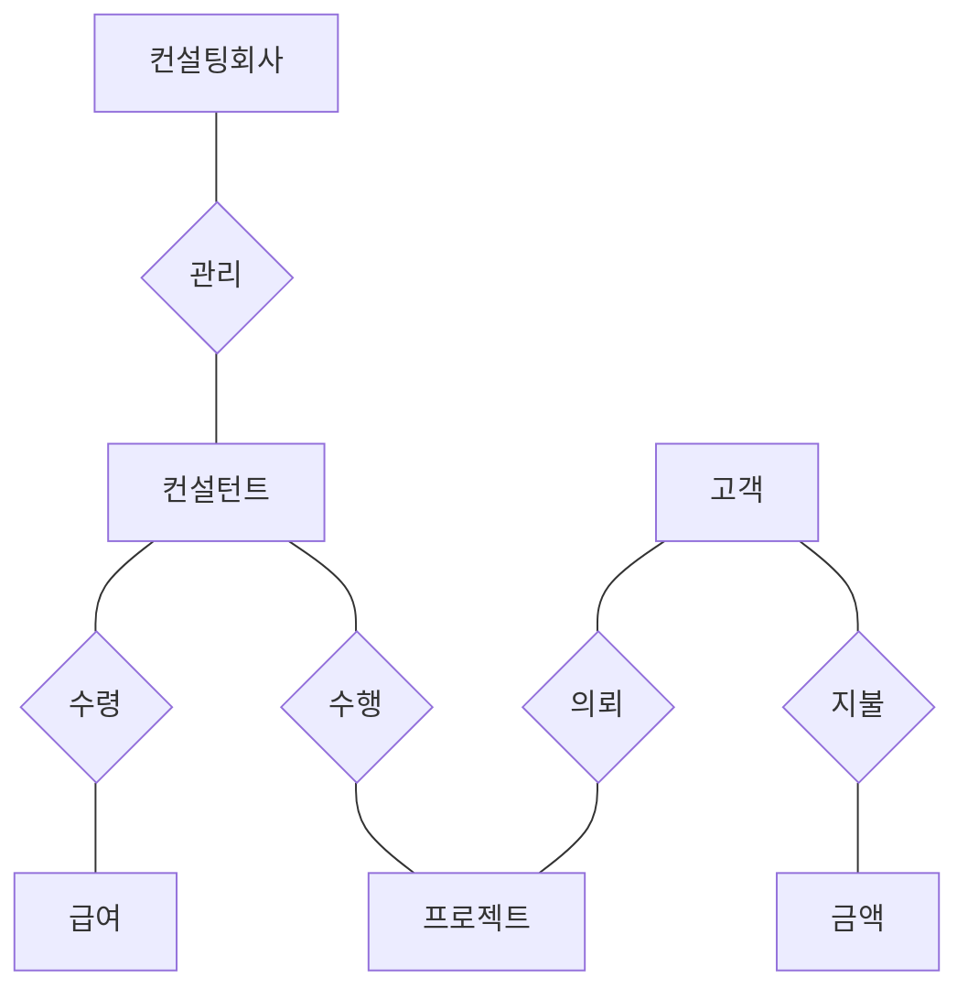
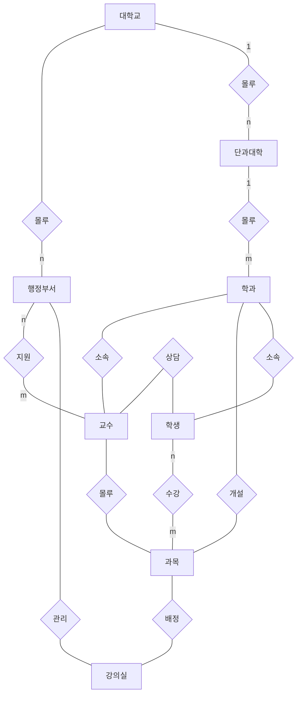

# 1.택배회사

```mermaid
flowchart LR
지점 -- 1 --- 지점고용{고용} -- n --- 직원
고객 -- m --- 접수{접수} -- n --- 직원
접수 -- n --- 물품 -- m --- 뭐시기{뭐시기} -- n --- 배송
직원 --- 뭐시기
```
# 2.컨설팅회사

```mermaid
flowchart TB
컨설팅회사 --- 관리{관리} --- 컨설턴트
컨설턴트 --- 수령{수령} --- 급여
컨설턴트 --- 수행{수행} --- 프로젝트
고객 --- 의뢰{의뢰} --- 프로젝트
고객 --- 지불{지불} --- 금액

```
# 3.음식배달
```mermaid
flowchart TB

```

# 4.대학교

```mermaid
flowchart TB
대학교 --- 몰루1{몰루} -- n --- 행정부서 -- n --- 지원{지원} -- m --- 교수
대학교 -- 1 --- 몰루2{몰루} -- n --- 단과대학 -- 1 --- 몰루3{몰루} -- m--- 학과
학과 --- 학과소속{소속} --- 교수 --- 몰루4{몰루} --- 과목
학과 --- 개설{개설} --- 과목 --- 배정{배정} --- 강의실
학과 --- 학생소속{소속} --- 학생 -- n --- 수강{수강} -- m --- 과목
행정부서 --- 관리{관리} --- 강의실


상담{상담} --- 교수
상담 --- 학생


```
