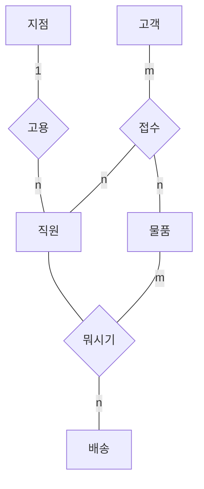
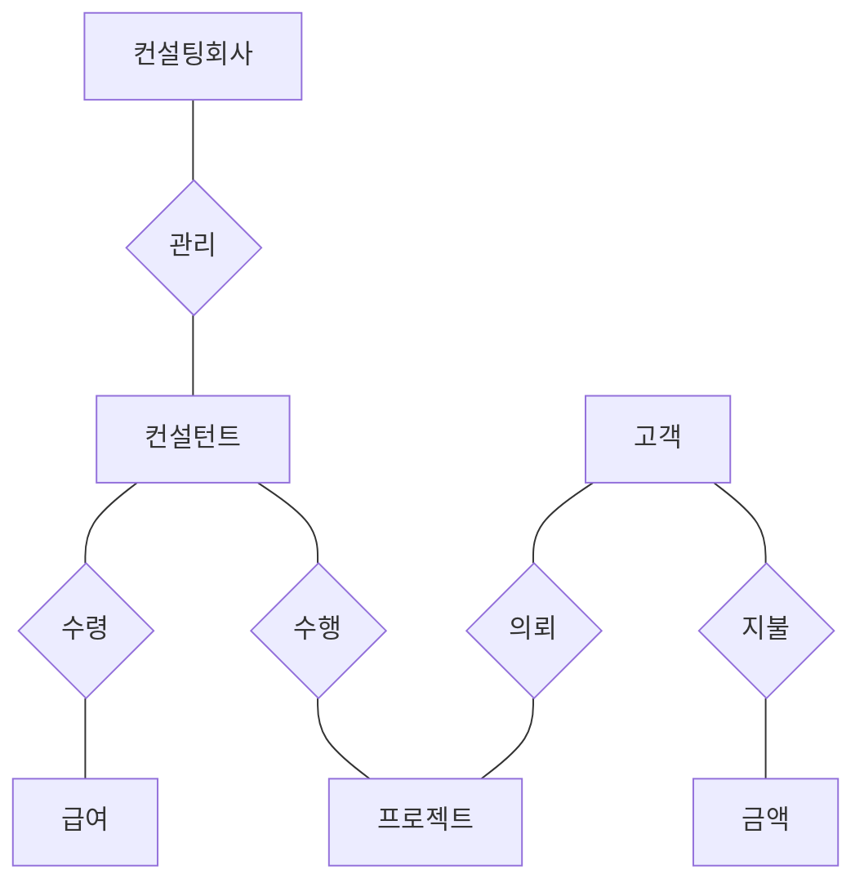

# 1.택배회사

```mermaid
flowchart 
지점 -- 1 --- 지점고용{고용} -- n --- 직원
고객 -- m --- 접수{접수} -- n --- 직원
접수 -- n --- 물품 -- m --- 뭐시기{뭐시기} -- n --- 배송
직원 --- 뭐시기
```
# 2.컨설팅회사

```mermaid
flowchart TB
컨설팅회사 --- 관리{관리} --- 컨설턴트
컨설턴트 --- 수령{수령} --- 급여
컨설턴트 --- 수행{수행} --- 프로젝트
고객 --- 의뢰{의뢰} --- 프로젝트
고객 --- 지불{지불} --- 금액

```
