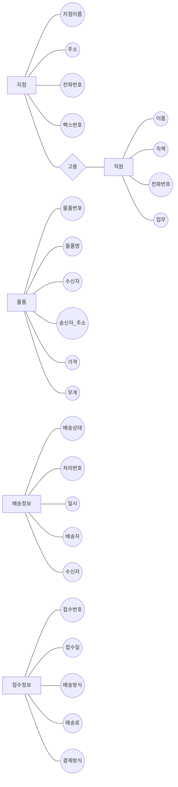

ER다이어그램 작성 
===
# 문제1) 택배 회사의 배송 업무

단국 택배회사는 전국에 여러 지점을 가지고 있으며 각 지점에는 직원들이 소속되어져 있다. 고객은 보내고자 하는 물건을 각 지점에 가지고 오면 직원들이 이를 접수하여 배송처리를 한다. 지점의 정보는 지점 이름, 주소, 전화번호, 팩스 번호가 필요하다. 직원들을 관리하기 위해서는 이름, 직책, 전화번호, 업무 등이 필요하며, 고객의 정보로는 고객번호, 이름, 전화번호, 주소 등이 필요하다.

정확한 배송을 위해 물품을 접수 받을 때 물품번호, 물품명, 수신자, 송신자 주소, 가격, 무게 등 정보가 필요하다. 배송 정보를 고객들에게 핸드폰으로 알려주기 위해 배송 상태, 처리번호, 일시, 배송자, 수신자 등의 정보가 필요하다. 직원들은 접수를 할 때 접수번호, 접수일, 배송방식, 배송료, 결제방식 등의 정보가 필요하다.

