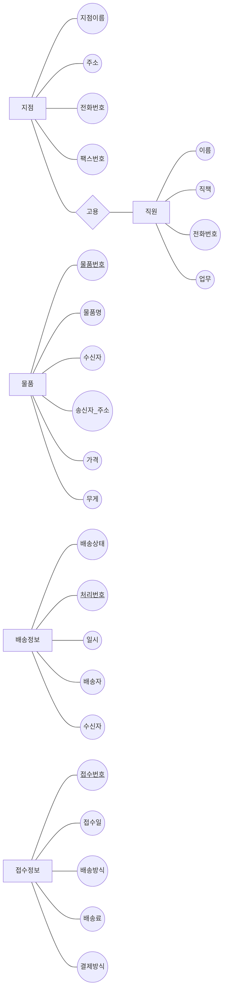
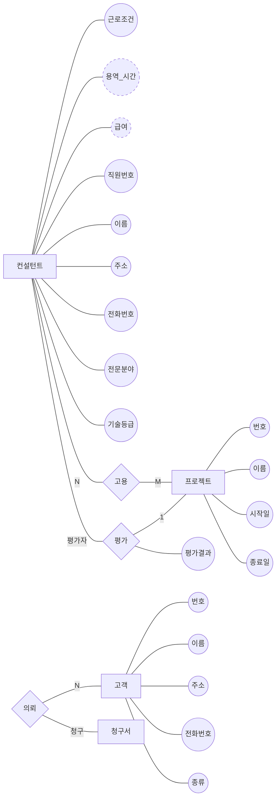

ER다이어그램 작성 
===
# 문제1) 택배 회사의 배송 업무

단국 택배회사는 전국에 여러 지점을 가지고 있으며 각 지점에는 직원들이 소속되어져 있다. 고객은 보내고자 하는 물건을 각 지점에 가지고 오면 직원들이 이를 접수하여 배송처리를 한다. 지점의 정보는 지점 이름, 주소, 전화번호, 팩스 번호가 필요하다. 직원들을 관리하기 위해서는 이름, 직책, 전화번호, 업무 등이 필요하며, 고객의 정보로는 고객번호, 이름, 전화번호, 주소 등이 필요하다.

정확한 배송을 위해 물품을 접수 받을 때 물품번호, 물품명, 수신자, 송신자 주소, 가격, 무게 등 정보가 필요하다. 배송 정보를 고객들에게 핸드폰으로 알려주기 위해 배송 상태, 처리번호, 일시, 배송자, 수신자 등의 정보가 필요하다. 직원들은 접수를 할 때 접수번호, 접수일, 배송방식, 배송료, 결제방식 등의 정보가 필요하다.

# 문제2) 컨설팅 회사

단국 컨설팅(주)은 여러 컨설턴트를 고용하고 있으며, 이들은 상근 또는 시간제로 근무하고 있다. 상근과 시간제 컨설턴트는 모두 수행한 프로젝트 용역 시간에 따라 월급제로 급여를 받는다. 컨설턴트에는 직원번호, 이름, 주소, 전화번호, 전문분야, 기술 등급에 대한 정보를 갖는다. 컨설턴트는 하나 이상의 프로젝트에 할당되어 고객의 문제를 해결하는 일을 한다. 프로젝트에는 번호, 이름, 시작일, 종료일 등을 기록한다.

각 프로젝트에 따라 여러 컨설턴트가 할당 될 때도 있다. 각 컨설턴트는 할당된 프로젝트의 수행을 완료하면 회사 규정에 따라 상급 컨설턴트에 의해 평가를 받게 되며 회사는 이 자료를 관리한다.

고객은 하나 이상의 프로젝트를 의뢰할 수가 있고 고객의 정보는 번호, 이름, 주소, 전화번호 등을 기록한다. 고객은 개인 고객과 법인 고객으로 나뉘어진다.

회사는 과제를 의뢰한 고객에게 프로젝트가 완료되면 컨설팅 대금 전액을 청구하고, 고객은 청구 대금을 여러 차례에 걸쳐 납기일까지 지불할 수가 있다. 청구서에는 청구서 번호. 납기일, 그리고 금액을 기록한다.

